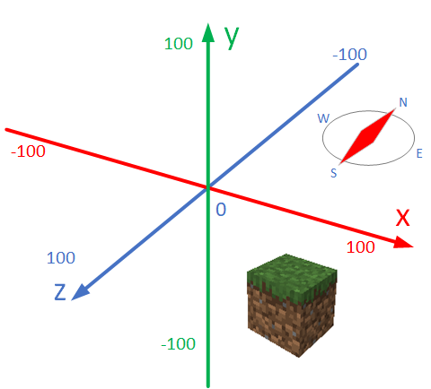

# Coordinates and Positions

***

## Learning objectives

By the end of this lesson you will be able to:

* explain what the **x**, **y**, and **z** coordinates mean in Minecraft
* use the player's position as a starting point for building
* place marker blocks relative to where you are standing
* describe how changing x, y, or z changes location in the world

***

## Theory: understanding Minecraft coordinates

The original website teaches students to read their location with `mc.player.getPos()` and `mc.player.getTilePos()`. In Minecraft Education, you do not need a separate Python connection for that.

Instead, you work from your in-game location and use position tools to build **relative** to where the player is standing.



### Coordinate directions

* **x** changes east and west
* **y** changes up and down
* **z** changes north and south

If your world has **Show Coordinates** turned on, you can watch the numbers change as you move.

***

## Code example

```python
origin = player.position()

blocks.place(RED_WOOL, positions.add(origin, pos(1, 0, 0)))
blocks.place(LIME_WOOL, positions.add(origin, pos(0, 1, 0)))
blocks.place(BLUE_WOOL, positions.add(origin, pos(0, 0, 1)))
```

### What this code does

* saves your current location in a variable called `origin`
* places a **red** block one step along the x-axis
* places a **lime** block one step up on the y-axis
* places a **blue** block one step along the z-axis

This creates a simple 3D coordinate marker around the player.

***

## Try it

1. Stand in an open area.
2. Run the code.
3. Look carefully at where each coloured block appears.
4. Move to another spot and run it again.

***

## Modify it

Try these changes one at a time:

1. Change `pos(1, 0, 0)` to `pos(3, 0, 0)`.
2. Change `pos(0, 1, 0)` to `pos(0, 3, 0)`.
3. Add another block at `pos(-1, 0, 0)`.
4. Add a gold block two blocks below with `pos(0, -2, 0)`.

***

## Source mission remake

The original website asked students to:

* find their location
* teleport to exact positions
* place blocks in the x, y, and z directions

In Minecraft Education, this remix focuses on **relative building around the player**, which is easier and safer for beginners than teleporting the player around the map.


***

## Challenge

Build a small coordinate cross around yourself:

* 3 blocks in the positive x direction
* 3 blocks in the negative x direction
* 3 blocks in the positive z direction
* 3 blocks straight up

Use different block colours for each direction.

***

## Key vocabulary

| Term                  | Meaning                                       |
| --------------------- | --------------------------------------------- |
| **Coordinate**        | A number that tells you a location            |
| **Position**          | A place in the Minecraft world                |
| **Relative position** | A location measured from a starting point     |
| **Axis**              | One direction of movement, such as x, y, or z |

***

## What's next

Now that you can build relative to your current location, the next lesson remakes the original `setBlock` and `setBlocks` tasks using Minecraft Education block commands.

➡️ **Next:** [Placing Blocks with Positions](02_placing_blocks_with_positions.md)
