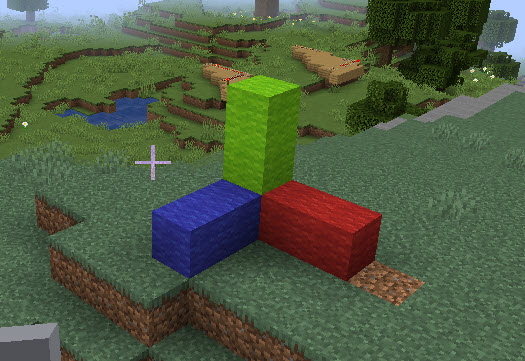

# Placing Blocks with Positions

***

## Learning objectives

By the end of this lesson you will be able to:

* place one block at a chosen position
* fill a short line or area with blocks
* use a saved starting position to control where builds appear
* explain the difference between placing one block and filling many blocks

***

## Theory: from `setBlock()` to `blocks.place()`

The original website uses commands like:

```python
mc.setBlock(x, y, z, block_id)
mc.setBlocks(x, y, z, x1, y1, z1, block_id)
```

In Minecraft Education, the matching ideas are:

* `blocks.place()` for **one block**
* `blocks.fill()` for **many blocks at once**

These commands let you create the same kinds of structures without using `mcpi`.

***

## Code example 1: place single blocks

```python
origin = player.position()

blocks.place(GOLD_BLOCK, positions.add(origin, pos(1, 0, 0)))
blocks.place(GLASS, positions.add(origin, pos(2, 0, 0)))
blocks.place(STONE, positions.add(origin, pos(3, 0, 0)))
```

This places three different blocks in a straight line beside the player.



***

## Code example 2: fill a line

```python
origin = player.position()

blocks.fill(
    STONE,
    positions.add(origin, pos(0, 0, 2)),
    positions.add(origin, pos(4, 0, 2)),
    FillOperation.REPLACE
)
```

This creates a 5-block line of stone two blocks in front of the player.

***

## Try it

1. Run the single-block example.
2. Run the fill example.
3. Compare the result.
4. Move to a new spot and run the code again.

***

## Modify it

Try these edits:

1. Change `STONE` to `WOOD`.
2. Change the end position from `pos(4, 0, 2)` to `pos(8, 0, 2)`.
3. Fill a vertical column instead of a floor line by changing the second point to `pos(0, 4, 2)`.

***

## Challenge

Build a coloured starter platform around yourself:

* a 5-block line of stone in front
* a 5-block line of glass behind
* one gold block on your right
* one diamond block on your left

Try to predict where each piece will appear before you run the program.

***

## Source mission remake

This lesson remakes the original website tasks about:

* placing a block beside the player
* placing multiple blocks in the x, y, and z directions
* using `setBlocks` to create lines and simple shapes

***

## What's next

The next lesson remakes the website's loop, wall, cube, and pyramid activities using Minecraft Education Python.

➡️ **Next:** [Loops, Walls, and Pyramids](03_loops_walls_and_pyramids.md)
