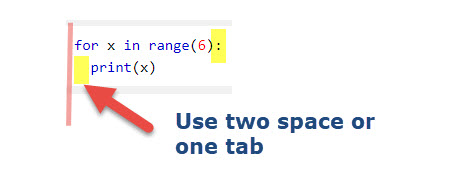
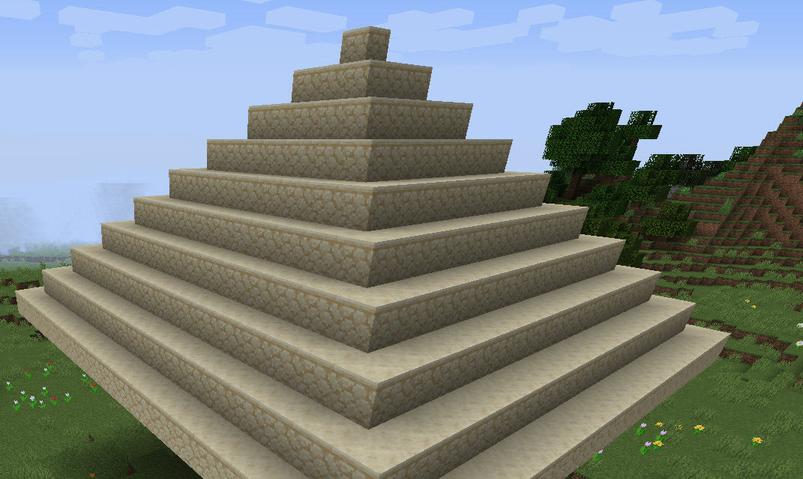

# Loops, Walls, and Pyramids

***

## Learning objectives

By the end of this lesson you will be able to:

* use a `for` loop to repeat building actions
* use nested loops to create a wall
* explain how a loop controls height, width, and depth
* build a simple pyramid with changing layer sizes

***

## Theory: repeating builds efficiently

The original website uses loops to stack blocks, build walls, create cubes, and make a pyramid.

That same idea works perfectly in Minecraft Education. A loop lets you write a build rule once and repeat it many times.



***

## Code example 1: stack a pillar

```python
origin = player.position()

for height in range(5):
    blocks.place(STONE, positions.add(origin, pos(0, height, 1)))
```

This builds a 5-block pillar one block in front of the player.

***

## Code example 2: build a wall with nested loops

```python
origin = player.position()

for height in range(5):
    for width in range(5):
        blocks.place(STONE, positions.add(origin, pos(width, height, 3)))
```

The outer loop controls the rows. The inner loop controls the blocks across each row.

***

## Add a pattern with a conditional

```python
origin = player.position()

for height in range(5):
    for width in range(5):
        if width == height:
            blocks.place(GOLD_BLOCK, positions.add(origin, pos(width, height, 5)))
        else:
            blocks.place(STONE, positions.add(origin, pos(width, height, 5)))
```

This creates a diagonal stripe across the wall.

***

## Pyramid remake

The original website finishes the section with a pyramid challenge. Here is a Minecraft Education version:

```python
origin = player.position()
levels = 5

for level in range(levels):
    size = levels - level
    blocks.fill(
        SANDSTONE,
        positions.add(origin, pos(-size, level, 8 - size)),
        positions.add(origin, pos(size, level, 8 + size)),
        FillOperation.REPLACE
    )
```



***

## Try it

1. Build the pillar.
2. Build the wall.
3. Add the diagonal pattern.
4. Build the pyramid.

***

## Modify it

Try these changes:

1. Change the wall from 5×5 to 8×6.
2. Replace `STONE` with `GLASS`.
3. Change the pyramid material to `GOLD_BLOCK` or `BRICKS`.
4. Make the pyramid taller by changing `levels`.

***

## Challenge

Create a mini build zone with all three structures:

* one pillar
* one patterned wall
* one small pyramid

Place them so they do not overlap.

***

## Source mission remake

This lesson remakes the website's:

* stack 5 blocks task
* double-loop wall task
* condition wall pattern task
* cube and pyramid extension tasks

***

## What's next

The next lesson rewrites the original string, number, and chat tasks so they work inside Minecraft Education without `input()` or terminal-based Python.

➡️ **Next:** [Strings, Numbers, and Messages](04_strings_numbers_and_messages.md)
