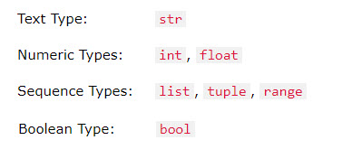

# Strings, Numbers, and Messages

***

## Learning objectives

By the end of this lesson you will be able to:

* explain the difference between strings and numbers
* use `str()` to join text with a number
* use `player.say()` to show messages in Minecraft Education
* use a variable to control a build
* use a short pause to compare two player positions

***

## Theory: adapting chat and input for Minecraft Education

The original website uses `mc.postToChat()` and `input()` in regular Python.

Minecraft Education is different:

* there is no normal terminal input box for `input()`
* classroom scripts usually work better with **variables**, **chat commands**, and visible in-world actions

So in this remix, students still practise **strings**, **numbers**, and **conversion**, but in a way that suits Code Builder.



***

## Code example 1: strings and numbers together

```python
builder_name = "Alex"
tower_height = 4

player.say(builder_name + " is building a tower of " + str(tower_height) + " blocks.")
```

This works because `tower_height` is converted from a number to text using `str()`.

***

## Code example 2: use a number in a build

```python
tower_height = 5
origin = player.position()

for level in range(tower_height):
    blocks.place(GOLD_BLOCK, positions.add(origin, pos(0, level, 1)))
```

Change the number and the structure changes automatically.

***

## Code example 3: measure movement after a pause

```python
start = player.position()
player.say("Move somewhere else in the next 5 seconds.")
loops.pause(5000)
finish = player.position()

x_distance = abs(start.get_value(Axis.X) - finish.get_value(Axis.X))
y_distance = abs(start.get_value(Axis.Y) - finish.get_value(Axis.Y))
z_distance = abs(start.get_value(Axis.Z) - finish.get_value(Axis.Z))

player.say("Moved x=" + str(x_distance) + " y=" + str(y_distance) + " z=" + str(z_distance))
```

This remakes the original website's distance-after-sleep activity.

***

## Try it

1. Run the message example.
2. Change the builder name.
3. Change the tower height.
4. Try the movement check and walk to a new location before the pause ends.

***

## Modify it

Try these edits:

1. Change `tower_height` from `5` to `8`.
2. Change `GOLD_BLOCK` to `GLASS`.
3. Add a second message that says whether the tower is short or tall.

***

## Challenge

Create a program that:

* stores your name in a string variable
* stores a build size in a number variable
* says a message using both values
* builds a pillar using the number variable

***

## Source mission remake

This lesson remakes the website's ideas about:

* posting to chat
* joining strings together
* converting strings and numbers
* waiting with `sleep`
* measuring how far a player moved

***

## What's next

The next lesson remakes the website's `if`, `elif`, `else`, and logical-operator tasks by using pattern building and simple world checks.

➡️ **Next:** [Conditionals and Pattern Building](05_conditionals_and_pattern_building.md)
