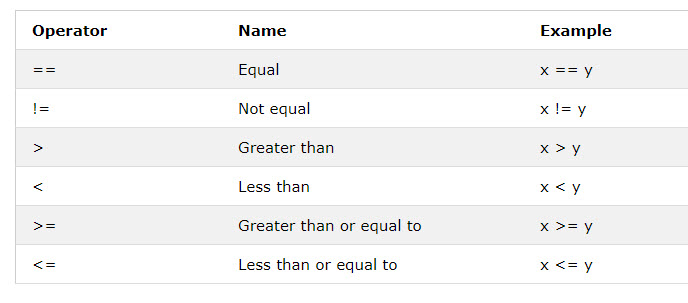

# Conditionals and Pattern Building

***

## Learning objectives

By the end of this lesson you will be able to:

* use `if`, `elif`, and `else`
* explain how Boolean conditions control a program
* use a condition to choose a building material
* use a condition inside a loop to create a pattern

***

## Theory: making decisions in code

The original website uses conditionals to check whether a player is in water, in air, or on the ground. It also asks students to add patterns to a wall.

In Minecraft Education, the most beginner-friendly version of that idea is to:

* check a simple world condition
* choose materials based on variable values
* create visible patterns with `if` statements



***

## Code example 1: choose a material with `if`

```python
wall_size = 6

if wall_size > 5:
    wall_block = GOLD_BLOCK
elif wall_size > 3:
    wall_block = GLASS
else:
    wall_block = STONE
```

This stores a different block type depending on the size.

***

## Code example 2: use the material in a build

```python
wall_size = 6

if wall_size > 5:
    wall_block = GOLD_BLOCK
elif wall_size > 3:
    wall_block = GLASS
else:
    wall_block = STONE

origin = player.position()

for row in range(wall_size):
    for column in range(wall_size):
        blocks.place(wall_block, positions.add(origin, pos(column, row, 2)))
```

***

## Code example 3: add a diagonal pattern

```python
origin = player.position()

for row in range(6):
    for column in range(6):
        if row == column:
            blocks.place(DIAMOND_BLOCK, positions.add(origin, pos(column, row, 5)))
        else:
            blocks.place(STONE, positions.add(origin, pos(column, row, 5)))
```

***

## Code example 4: check the block under the player

```python
below_player = positions.add(player.position(), pos(0, -1, 0))

if blocks.test_for_block(GRASS, below_player):
    player.say("You are standing on grass.")
else:
    player.say("You are standing on a different block.")
```

This is the Minecraft Education version of the website's "what block am I on?" idea.

***

## Try it

1. Run the material-choice code.
2. Change `wall_size` to `2`, `4`, and `7`.
3. Build the diagonal pattern wall.
4. Stand on a grass block and test the block-check code.

***

## Modify it

Try these changes:

1. Change the diagonal to a border pattern.
2. Use `BRICKS` for medium size and `GLASS` for large size.
3. Add another condition for a second stripe where `row + column == 5`.

***

## Challenge

Build a 7×7 patterned wall where:

* the border is `GOLD_BLOCK`
* the diagonal is `DIAMOND_BLOCK`
* all other blocks are `STONE`

You will need more than one condition.

***

## Source mission remake

This lesson remakes the website's:

* comparator and Boolean examples
* `if/elif/else` examples
* logical operator ideas
* block-checking activity
* patterned wall extension

***

## What's next

The original website includes a "drop flowers while you move" sample. The next lesson turns that into a classroom-friendly Minecraft Education trail-art activity.

➡️ **Next:** [Trail Art Remix](06_trail_art_remix.md)
