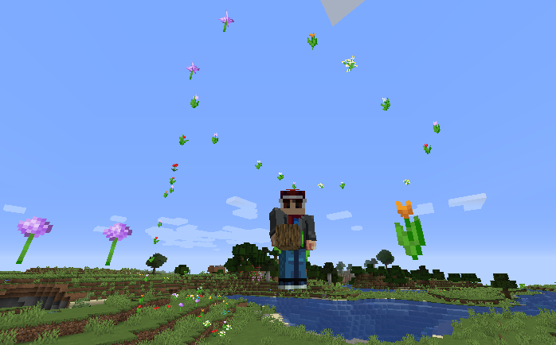

# Trail Art Remix

***

## Learning objectives

By the end of this lesson you will be able to:

* use a loop to repeat an effect over time
* build art based on player movement
* use a list of materials to alternate colours
* explain how a timed loop can sample the player's position

***

## Theory: remixing the flower trail idea

The original website includes a sample that drops random flowers while the player moves.

That sample depends on the older `mcpi` API and flower metadata values. In Minecraft Education, this remix keeps the same idea but uses a **safe built-in colour trail** instead.

The result still teaches:

* repetition
* position sampling
* visible feedback in the world



***

## Code example

```python
trail_blocks = [RED_WOOL, ORANGE_WOOL, YELLOW_WOOL, LIME_WOOL, LIGHT_BLUE_WOOL]

for step in range(25):
    current_spot = positions.add(player.position(), pos(0, -1, 0))
    blocks.place(trail_blocks[step % len(trail_blocks)], current_spot)
    loops.pause(300)
```

### What this code does

* watches the player's position 25 times
* places a coloured block under the player
* cycles through the list of colours
* pauses briefly between each placement so the trail follows movement

***

## Try it

1. Stand in an open flat area.
2. Start moving as soon as you click **Run**.
3. Watch the coloured trail appear under you.

***

## Modify it

Try these changes:

1. Change `25` to `40` to make the trail longer.
2. Change the pause from `300` to `150` for a denser trail.
3. Replace one colour in the list with `WHITE_WOOL` or `BLACK_WOOL`.

***

## Challenge

Create a trail that uses exactly three colours and spells out a path around a build area. Try to make the colour order repeat in a predictable pattern.

***

## Source mission remake

This lesson remakes the website's `dropflower.py` and `dropflower_withsize.py` samples by replacing the old plugin-based flower metadata approach with a MakeCode Python trail effect.

***

## What's next

The final lesson remakes the rainbow sample from the website as a Minecraft Education arch build challenge.

➡️ **Next:** [Rainbow Build Challenge](07_rainbow_build_challenge.md)
