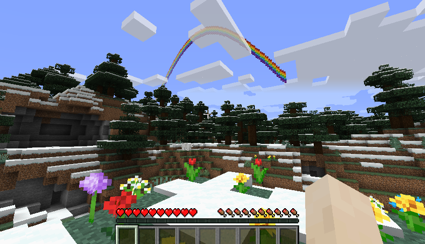

# Rainbow Build Challenge

---

## Learning objectives

By the end of this lesson you will be able to:

- use lists to store build data
- combine loops with a height pattern
- build a multi-colour arch in Minecraft Education
- explain how data can control a shape

---

## Theory: remaking the rainbow sample

The original website includes a rainbow script that uses trigonometry and coloured wool metadata to draw a large arc.

This Minecraft Education version keeps the same visual idea but uses:

- a list of wool colours
- a list of arch heights
- nested loops with `blocks.place()`

This makes the activity more readable for beginners while still producing a strong result.



---

## Code example

```python
colors = [RED_WOOL, ORANGE_WOOL, YELLOW_WOOL, LIME_WOOL, LIGHT_BLUE_WOOL, BLUE_WOOL, PURPLE_WOOL]
heights = [0, 1, 2, 3, 4, 5, 6, 7, 8, 8, 7, 6, 5, 4, 3, 2, 1, 0]

origin = player.position()

for x in range(len(heights)):
    for stripe in range(len(colors)):
        blocks.place(
            colors[stripe],
            positions.add(origin, pos(x - 9, heights[x] + stripe, 3))
        )
```

### What this code does

- `heights` controls the shape of the arch
- `colors` controls the rainbow stripes
- the outer loop moves across the rainbow
- the inner loop stacks the colours upward

---

## Try it

1. Run the code in an open area.
2. Step back and inspect the arch.
3. Predict what will happen if you change the numbers in `heights`.

---

## Modify it

Try these changes:

1. Add extra middle values to make the rainbow wider.
2. Replace one stripe with `WHITE_WOOL` to create a cloud edge.
3. Build a second rainbow a few blocks behind the first one.

---

## Collaborative option: shared world

Students can complete this challenge together in one Minecraft Education world.

1. One student creates or opens the world and turns **Multiplayer** on.
2. In-game, choose **Host World** and share the **Join Code**.
3. Other students select **Join World** and enter the code.
4. Assign team roles (for example: `driver`, `navigator`, `tester`, `builder`).
5. Build one rainbow scene together, then test and improve it as a team.

If joining does not work, check that school accounts are signed in, multiplayer is enabled by admin settings, and the network/firewall allows Minecraft Education multiplayer.

---

## Challenge

Turn the arch into a full scene by adding:

- a cloud at one end
- a second smaller arch behind it
- a gold block treasure marker underneath

---

## Source mission remake

This lesson remakes the website's rainbow script while removing the old `mcpi` connection code and metadata-based wool values.

---