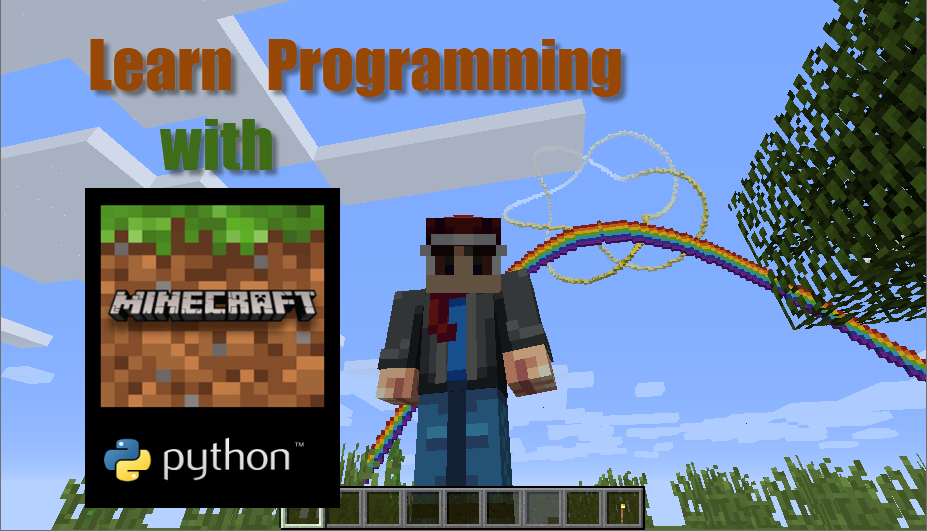

# lessons\_education\_remix

This folder contains a **second lesson set** remade from the website at https://stoneskin.github.io/python-minecraft/ and rewritten for **Minecraft Education + Code Builder + MakeCode Python**.

## What changed in this remix?

* All lessons now work with **Minecraft Education** instead of Minecraft Java + RaspberryJuice + `mcpi`
* Code examples use **built-in Minecraft Education Python tools** only
* No external libraries, plugins, server setup, or mods are required
* Activities have been rewritten to match the style of the existing course in this workspace
* Images from the original website are stored locally in this folder and embedded in the lessons

## Lesson sequence

1. [Setup for the Website Remix](00_setup_remix.md)
2. [Coordinates and Positions](01_coordinates_and_positions.md)
3. [Placing Blocks with Positions](02_placing_blocks_with_positions.md)
4. [Loops, Walls, and Pyramids](03_loops_walls_and_pyramids.md)
5. [Strings, Numbers, and Messages](04_strings_numbers_and_messages.md)
6. [Conditionals and Pattern Building](05_conditionals_and_pattern_building.md)
7. [Trail Art Remix](06_trail_art_remix.md)
8. [Rainbow Build Challenge](07_rainbow_build_challenge.md)

## Teacher note

The original site mixes three things together:

* Python syntax practice
* Minecraft API practice using `mcpi`
* server and plugin setup

This remix keeps the **teaching ideas** while replacing the old API calls with **Minecraft Education commands and patterns** that students can run directly inside Code Builder.

➡️ **Start here:** [Setup for the Website Remix](00_setup_remix.md)
